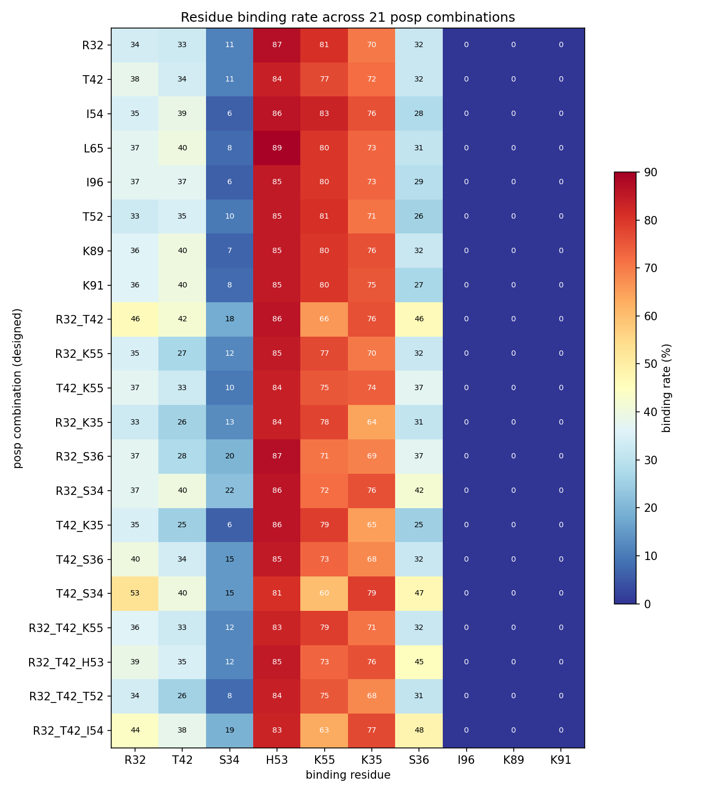
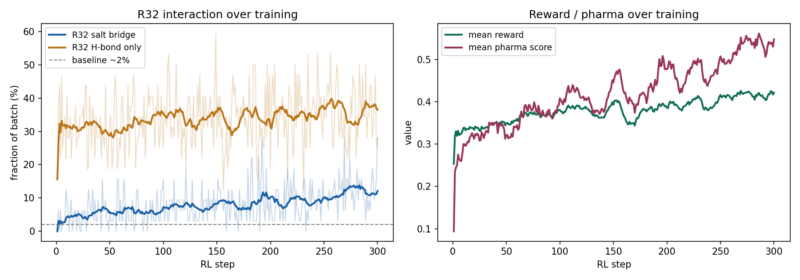
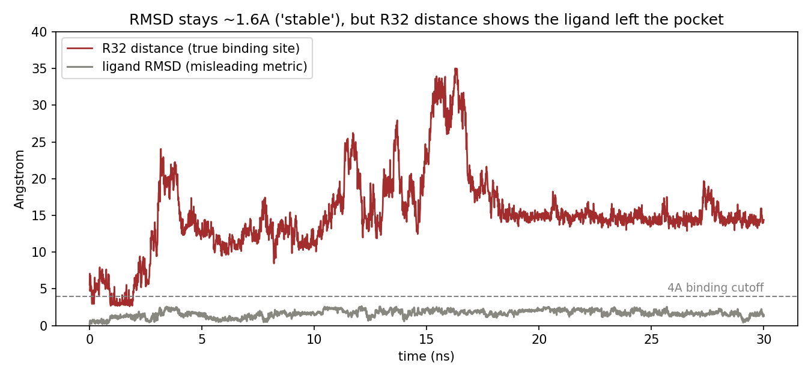
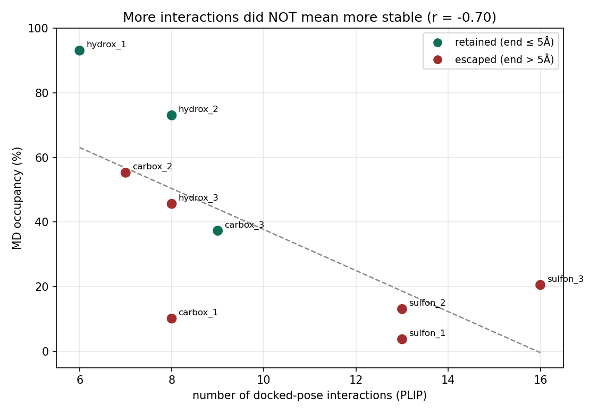

# SHP2 N-SH2 PPI 저해제 in-silico 탐색

생성형 AI(Hot2Mol) → 도킹(Uni-Dock) → 분자동역학(OpenMM)으로 SHP2 N-SH2 도메인의 단백질-단백질 상호작용(PPI) 저해제를 탐색하고, 평평한 PPI 포켓에서 단일 소분자가 안정적 결합을 유지하기 어렵다는 점을 정량·구조적으로 규명한 프로젝트입니다.

핵심은 두 가지입니다. 하나는 생성 모델을 목표 방향으로 fine-tuning하기 위한 강화학습 reward를 직접 설계한 것이고, 다른 하나는 in-silico 결과를 단계마다 비판적으로 검증해 "왜 안 되는가"를 데이터로 규명한 것입니다.

---

## 1. 배경 — 왜 이 타겟이 어려운가

SHP2는 발암 신호전달에 관여하는 단백질 인산가수분해효소로, N-SH2 도메인이 GAB1·IRS1 같은 파트너의 인산화 타이로신(pY) 펩타이드를 인식하면서 활성화됩니다. 이 pY 결합을 저분자로 차단하면 SHP2 활성화를 막을 수 있습니다.

문제는 SH2 도메인의 pY 결합 자리가 효소 활성 포켓 같은 깊은 주머니가 아니라 **비교적 평평한 표면**이라는 점입니다. 천연 리간드는 긴 펩타이드 사슬이라 여러 잔기에 걸쳐 누우며 결합하지만, 작은 단일 분자가 같은 자리를 안정적으로 차지하기는 본질적으로 어렵습니다. 이 프로젝트는 그 어려움을 정면으로 다룹니다.

문헌(Anselmi et al., 2020) 기준 핵심 결합 잔기는 **R32**(pY 인산기와 염다리, SH2 도메인에서 98% 보존)와 **T42**(곁사슬 수소결합, SHP2 N-SH2 특이적)입니다.

---

## 2. 파이프라인


| 단계 | 도구 | 내용 |
|---|---|---|
| 타겟 준비 | AlphaFold3 | N-SH2 도메인 구조 예측, 도킹 receptor 확보 |
| 생성 + 강화학습 | Hot2Mol + RL | pharmacophore 조건부 생성 + reward fine-tuning |
| 스크리닝 | Uni-Dock + PLIP | 도킹 우선순위화 + 잔기별 상호작용 판정 |
| 약물성 필터 | QEPPI · SA · ADMET | PPI 특화 약물성 기준 선별 |
| 안정성 검증 | OpenMM MD | 30ns × replicate, 결합 유지 여부 추적 |

---

## 3. 타겟 구조 준비 (AlphaFold3)

SHP2 N-SH2 도메인 구조를 AlphaFold3로 예측했습니다. 야생형·발암 변이체(D61G, E76K, Y63C)·GAB1 펩타이드 복합체·full-length(자가억제형/열린형) 등 8가지 조건을 예측해 타겟 생물학을 검토하고, 야생형 N-SH2 단독 구조를 도킹 receptor로 사용했습니다(seed 3개 × 모델 5개로 반복, pTM 0.84 ± 0.002, PAE 3.9 ± 0.07 Å). 천연 결합 파트너인 GAB1 pY627 복합체도 예측해(ipTM 0.79) N-SH2가 인산펩타이드를 인식하는 결합 양식을 확인했습니다.


타겟 잔기들의 국소 신뢰도(pLDDT, 15개 모델 평균)는 결합 포켓 영역이 특히 높았습니다.

| 잔기 | 역할 | pLDDT |
|---|---|---|
| R32 | 염다리 (논문 핵심) | 97.5 ± 0.1 |
| T42 | 수소결합 (논문 핵심) | 96.6 ± 0.1 |
| S34 | 수소결합 | 95.2 ± 0.2 |
| K55 | 추가 타겟 (양전하) | 93.6 ± 0.2 |
| S36 | 수소결합 | 91.3 ± 0.4 |

---

## 4. 타겟 잔기 검증 — 데이터로

논문이 지목한 잔기가 실제로 저분자 결합에서도 의미 있는지 직접 확인했습니다. 21개 pharmacophore 조합(posp)으로 각각 1000개씩 분자를 생성하고, 생성 분자가 실제로 어느 잔기를 잡는지 PLIP로 측정했습니다.



결과를 잔기 3그룹으로 나눌 수 있었습니다.

- **유도 가능한 타겟 (R32, T42)** — posp로 지정하면 결합률이 실제로 올랐습니다. 단일 지정 시 R32/T42 각 33~40%, R32_T42 동시 지정 시 46%/42%로 둘 다 상승. 논문과 일치해 reward 타겟으로 채택했습니다.
- **비특이적 자동 결합 자리 (H53, K55, K35)** — 어떤 조합을 지정하든 항상 높았습니다(H53 81~89%, K55 60~83%). 지정 없이도 분자가 알아서 잡는 자리로, reward에 넣으면 흔한 자리를 잡아 점수만 챙기는 reward hacking이 되므로 제외했습니다.
- **공략 불가 (I96, K89, K91)** — 전 조합 0%. 생성 분자 크기로는 닿지 못하는 영역으로 보류했습니다.

"결합률이 높다"와 "유도 가능하다"는 다르며, 후자만 reward 타겟으로 적합하다는 점을 데이터로 구분한 것이 이 분석의 핵심입니다.

---

## 5. 핵심 기여 — 강화학습 Reward 설계

### docking을 점수에서 게이트로

초기에는 docking·pharmacophore·안정성·막투과·합성가능성·적용범위 6개 구성품을 조합한 reward를 설계했습니다(곱셈/가산 등 setup A~G로 비교). 그러나 SH2 pY 포켓이 평평해 생성 분자의 docking score가 -5.5 ~ -6.0에 좁게 몰려 **변별력이 거의 없음**을 확인했습니다(잔기 검증·5만 분자 분포 모두 일치).

그래서 docking을 점수 항에서 빼고 통과 게이트로만 두고, 논문이 지목한 직접 상호작용을 reward 신호로 설계했습니다.

```
reward = sigmoid(2 · R32_염다리 + 1 · T42_수소결합) × gate
gate   = (QEPPI > 0.4) AND (SA < 5) AND (docking ≤ -4.5)
```

여기엔 한 가지 제약을 우회하는 설계가 들어갑니다. 생성 모델(Hot2Mol)이 음전하(NEG) pharmacophore 토큰을 지원하지 않아, R32 염다리에 필요한 음전하 작용기를 직접 유도할 수 없었습니다. 그래서 pharmacophore는 수소결합으로 골격만 유도하고, 음전하(염다리)는 reward가 탐색하도록 두는 **단계적 보상**(수소결합을 발판으로 염다리에 더 큰 보상)을 설계했습니다.

### REINVENT 4 augmented likelihood로 fine-tuning

```
log_p_aug = log_p_prior + σ · reward
loss      = (log_p_aug − log_p_agent)²
```

prior는 고정하고 agent의 decoder만 학습했습니다. sigma와 reward 가중치는 ablation으로 탐색했습니다(초기 σ=96/500/2000 학습 실패 → 곱셈/가산 × σ 64/128/256 스윕).

### 결과

학습된 체크포인트(300 step)로 936개를 생성해 측정한 결과, **R32 염다리 형성률이 baseline ~2%에서 13.1%로 상승**했고 다양성·약물성도 건강하게 유지됐습니다(mode collapse 없음).



학습 곡선에서 수소결합(발판)이 먼저 빠르게 오르고, 그 위에서 염다리(목표)가 뒤따라 상승하는 의도한 패턴이 관찰됩니다.

---

## 6. 생성 + 필터링

학습된 모델로 약 10만 개 분자를 생성하고, R32 근접·약물성(QEPPI/SA) 기준으로 strict 필터링해 4,893개를 Uni-Dock으로 도킹했습니다. PLIP로 결합을 확인한 뒤, 작용기 4종(카복실산·하이드록사메이트·설폰아미드·테트라졸)별로 후보를 선별해 MD 검증 대상을 확정했습니다.

```
10만 생성 → strict 필터 → 4,893 도킹 → 작용기별 선별 → MD 후보
```

---

## 7. 안정성 검증 (MD) — 왜 풀리는가

도킹·PLIP에서 좋아 보인 후보를 30ns MD에 넣어 결합 유지 여부를 추적했습니다. 이 단계에서 세 가지를 발견했습니다.

### (1) docking 점수 ≠ MD 안정성

도킹 상위 후보 다수가 MD 초반에 결합이 풀렸습니다. 시작 거리가 3 Å 이내인 후보는 버티고 4 Å 이상이면 빠르게 이탈하는 경향이 있었습니다.

### (2) 리간드 RMSD는 이탈을 잡지 못한다

안정성 판정에 흔히 쓰는 리간드 RMSD가, 단백질 정렬 후에도 리간드를 best-fit 재정렬해 **분자 내부 conformation 변화만 반영**했습니다. 실제로 포켓을 50 Å 이상 벗어난 분자도 RMSD는 평균 1.6 Å로 "안정"처럼 보였습니다. 이를 발견해 타겟 잔기까지의 실거리를 안정성 주 지표로 사용했습니다.



### (3) 단일 MD run은 운에 좌우된다

같은 분자를 3 replicate로 돌리면 occupancy가 4 ~ 85%로 크게 갈렸습니다. 단일 run 결과로는 안정성을 결론지을 수 없어, 이후 모든 판정에 replicate를 적용했습니다.

### MD 안정성 종합 (1차 4종 9개)

| 후보 | 작용기 | docked 결합수 | occ(%) | start(Å) | end(Å) | RMSD(Å) | 판정 |
|---|---|---|---|---|---|---|---|
| hydrox_1 | 하이드록사메이트 | 6 | 93.1 | 3.0 | 4.8 | 1.19 | 유지 |
| hydrox_2 | 하이드록사메이트 | 8 | 73.0 | 2.9 | 3.6 | 1.16 | 유지 |
| carbox_3 | 카복실산 | 9 | 37.3 | 2.9 | 3.3 | 1.35 | 유지(느슨) |
| carbox_2 | 카복실산 | 7 | 55.3 | 3.8 | 15.2 | 1.19 | 이탈 |
| hydrox_3 | 하이드록사메이트 | 8 | 45.6 | 2.9 | 13.1 | 1.66 | 이탈 |
| sulfon_3 | 설폰아미드 | 16 | 20.6 | 4.5 | 15.6 | 1.51 | 이탈 |
| sulfon_2 | 설폰아미드 | 13 | 13.1 | 3.7 | 19.0 | 1.36 | 이탈 |
| carbox_1 | 카복실산 | 8 | 10.2 | 2.8 | 14.1 | 2.67 | 이탈 |
| sulfon_1 | 설폰아미드 | 13 | 3.8 | 5.5 | 14.3 | 1.63 | 이탈 |

### 결합 수가 많다고 안정적이지 않았다

"결합 수가 많으면 오래 붙을 것"이라는 가설을 세우고, docked pose의 PLIP 결합 수와 MD occupancy를 비교했습니다. 결과는 가설과 반대로 **음의 상관(r = −0.70)**이었습니다. 결합이 가장 많은 후보(16개)가 이탈하고, 가장 적은 후보(6개)가 가장 안정적이었습니다.



이는 결합 개수 자체가 MD 안정성을 예측하지 못함을 보여줍니다. 다만 안정적이었던 후보가 특정 작용기(하이드록사메이트)에 몰려 있어, 결합 수의 영향과 작용기 종류의 영향이 이 데이터만으로는 분리되지 않습니다. 메커니즘 규명에는 추가 분석이 필요합니다.

### K55 추가 시도

결합 수를 늘리면 안정화될 수 있다는 가설로, R32+T42에 K55를 더한 3점 후보를 replicate MD로 검증했습니다. 그러나 같은 분자가 replicate마다 다른 잔기(K55/S34/S36 등)를 잡으며 일관되게 유지되지 않았습니다. 타겟 잔기 수를 늘리는 것만으로는 안정화되지 않았습니다.

---

## 8. 결론

- 생성 모델을 R32/T42 방향으로 fine-tuning하는 reward를 직접 설계해, R32 염다리 형성률을 ~2%에서 13.1%로 올렸습니다.
- docking 점수가 MD 안정성을 보장하지 않으며, 단일 MD와 단일 지표(RMSD)로는 안정성을 잘못 판정할 수 있음을 데이터로 확인했습니다.
- docked 결합 수와 MD 안정성은 음의 상관을 보였으며(r = −0.70), 결합 개수만으로 안정성을 예측할 수 없었습니다.
- 여러 작용기와 잔기 조합을 시도했으나 단일 소분자가 SH2 pY 포켓에서 결합을 안정적으로 유지하지 못했습니다. 이는 평평한 PPI 인터페이스의 본질적 어려움과 일관되나, 단정하기보다 후속 검증이 필요한 결과로 봅니다.

결과를 "약물 발굴 실패"가 아니라 **타겟의 druggability를 규명한 과정**으로 봅니다. 생성 모델의 목표지향 fine-tuning과 in-silico 결과의 단계별 비판적 검증을 모두 다룬 작업입니다.

---

## 9. 기술 스택

Python · PyTorch · RDKit · OpenMM · mdtraj · Biopython · Uni-Dock · PLIP · ADMET-AI · QEPPI · ChimeraX · AlphaFold3 · Hot2Mol(VAE + EGNN 기반 생성 모델)

## 10. 한계 및 추가 탐색

- R32 염다리를 형성하는 분자가 카복실산에 편향되는 경향을 관찰해 bioisostere(테트라졸·설폰아미드) 전환을 시도했으나, in-silico 막투과(Caco2) 이득은 확인되지 않았습니다.
- 결합 수와 작용기 종류가 안정성에 미치는 영향이 분리되지 않아 추가 검증이 필요합니다.
- MD 시간 규모(30ns)와 receptor의 apo 구조 사용은 결과 해석의 한계입니다.

## 11. 저장소 구조

```
├── scripts/
│   ├── reward/      # reward function 설계
│   ├── rl/          # REINVENT 4 DAP 강화학습
│   └── validation/  # MD 안정성 검증, 분석
├── figures/                # README 그림
└── data/                   # 입력 구조, posp (대용량 제외)
```

> 본 저장소에는 직접 작성한 코드(reward 설계, MD 분석)만 포함합니다. Hot2Mol 본체, 논문, 대용량 데이터(.smi/.dcd)는 제외했습니다.
